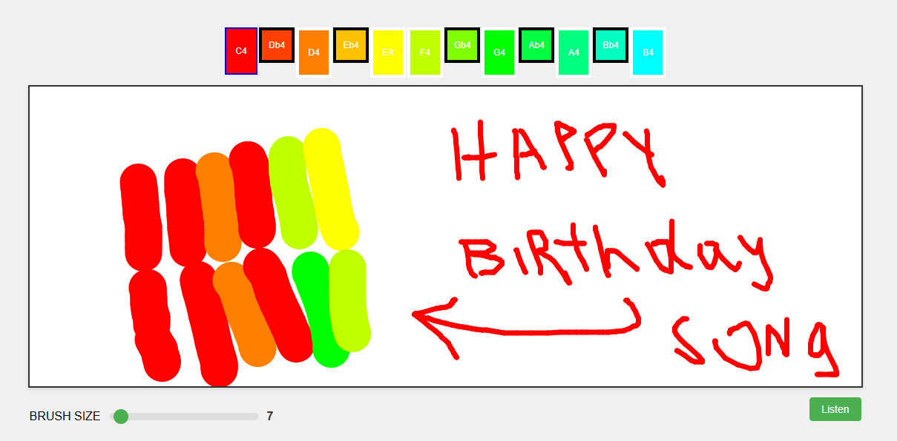

# React Native SoundPaint

A Web version of the same concept using React: 

SoundPaint lets you listen to your drawing or any pic. In an interactive or semirandom way. In a flexible relationship between colors and musical notes.

Actual state: Forked the repo, edited Readme, etc... 
No changes to the code yet, but soon.

Based on:

## Screenshot

## Tech Stack
- React
- Tone.js on Web Audio API for audio processing
- React Color for color selection
